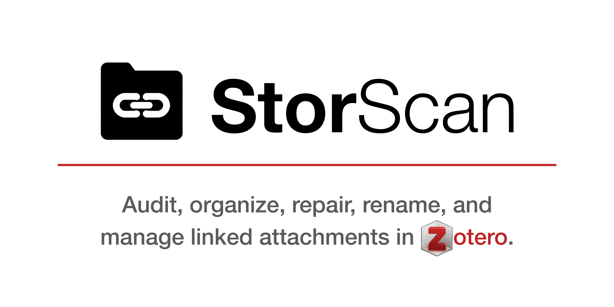

  

# StorScan

**Audit, organize, repair, rename, and manage linked attachments in Zotero.**

StorScan is an all-in-one attachment management toolkit for Zotero that helps researchers organize, repair, and maintain large libraries of linked attachments. It combines library auditing, attachment repair, author-folder organization, batch renaming, duplicate management, open-access full-text acquisition, and detailed reporting into a single integrated plugin.

---

# Features

## 🔍 Scan & Fix

Audit your Zotero library and identify attachment problems before making changes.

- **Scan Library** — Performs a comprehensive health check of every attachment in your library.
- **Fix Misplaced Files** — Finds linked PDFs whose filenames or locations differ from their canonical author-folder destinations, then moves, relinks, and verifies them.
- **Preview Cleanup** — Displays exactly what StorScan would change before any files are modified.

---

## 📁 Organize & Repair

Repair and organize linked attachments while preserving bibliographic records.

- **Organize Selected Item** — Repairs and reorganizes the attachments belonging to a selected Zotero item or any of its child attachments.
- **Organize All Files** — Applies canonical author-folder organization across the entire library.
- **Convert Stored Files** — Converts Zotero-managed stored attachments into verified linked attachments inside the configured Linked Attachment Base Directory.
- **Remove Broken Links** — Removes attachment records whose files no longer exist while preserving parent bibliographic items.
- **Merge Duplicate Files** — Consolidates duplicate linked PDFs stored within the attachment directory.
- **Merge Item Attachments** — Removes duplicate PDF attachments belonging to the same bibliographic item.

All file operations are verified before obsolete attachment records or redundant files are removed.

---

## ✏️ Rename

Rename linked attachments using Zotero metadata.

- **Preview Renaming** — Displays proposed filename changes before any files are renamed.
- **Rename All Attachments** — Renames linked attachments using Zotero's filename template, preferring the **Short Title** field whenever available and otherwise generating a concise title excerpt from the full title.

StorScan also updates Zotero attachment titles to match the renamed files.

---

## 📚 Find Full Text

Locate and attach legally available full text to existing bibliographic records.

- **Find Open Full Text** — Searches supported open-access providers using DOI metadata when available.
- **Attach Local File** — Imports an existing PDF or EPUB into the selected Zotero item while automatically organizing, renaming, verifying, and linking the file.
- **Search Open Library** — Opens a search for publicly available bibliographic records.
- **Full-Text Settings** — Configures open-access lookup preferences.

Imported files automatically pass through StorScan's organization and renaming workflow.

---

## 🛠 Utilities

Additional tools simplify maintenance and troubleshooting.

- **Inspect Selected Item** — Displays detailed diagnostic information for the selected bibliographic item or any of its child attachments, including canonical destination, link mode, resolved paths, and verification status.
- **Open Base Directory** — Opens the configured Linked Attachment Base Directory directly in your operating system's file manager.

---

# Author-Folder Organization

StorScan incorporates and extends the author-folder organization system originally developed for **Author Folder Organizer**.

Folder names, filename length, multiple-author handling, and folder templates are fully customizable through StorScan's Preferences.

Every imported, moved, or reorganized attachment automatically follows the same author-folder rules.

---

# Reporting

Every major StorScan operation generates a detailed report summarizing:

- Files processed
- Files moved
- Files renamed
- Duplicate files merged
- Broken links removed
- Items skipped
- Verification results
- Errors encountered

Reports automatically resize, become scrollable for large jobs, and can be copied or exported as UTF-8 text files for documentation or troubleshooting.

---

# Designed for Large Libraries

StorScan is designed for researchers managing extensive Zotero libraries with linked attachments.

Whether you're migrating an existing collection, reorganizing thousands of PDFs, repairing broken links, or maintaining a consistent attachment structure, StorScan provides a unified workflow for keeping your library clean, organized, and reliable.

---

# Requirements

- Zotero 9
- Linked Attachment Base Directory configured (recommended)

---

# Installation

1. Download the latest **StorScan** release from the GitHub Releases page.
2. Open **Zotero**.
3. Go to **Tools → Plugins**.
4. Click the ⚙️ gear icon.
5. Choose **Install Plugin From File…**
6. Select the downloaded `.xpi` file.
7. Restart Zotero.

---

# Credits

StorScan was vibe coded with **ChatGPT EDU** by **Brian J. Griffith** with code derived from **Author Folder Organizer** by **Emiliano Heyns**.

---

# License

Please see the repository for licensing information.
